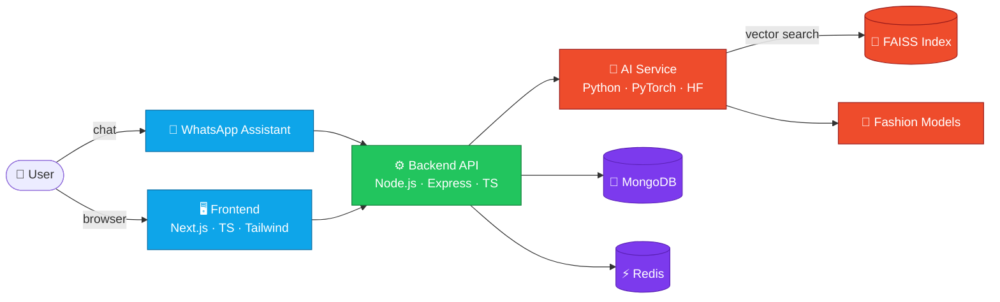

<div align="center">

# ✨ AI Lifestyle Assistant ✨

### Your personal AI for fashion, travel, and everyday planning


<br/>


<br/>


</div>

---

## 🌟 Overview

An AI-powered personal lifestyle assistant that brings together everything you need to look good and plan smart — in one conversational experience.

<table>
<tr>
<td width="33%" align="center">

### 👗
**Fashion Recommendations**

Outfit ideas tailored to your style, body type, and wardrobe.

</td>
<td width="33%" align="center">

### 🧳
**Trip Planning**

Itineraries, packing lists, and destination picks built around you.

</td>
<td width="33%" align="center">

### 🌦️
**Weather-Aware Planning**

Plans that adapt to the forecast before you step outside.

</td>
</tr>
<tr>
<td width="33%" align="center">

### 🗓️
**Scheduling**

Reminders and calendar-smart suggestions that keep your day flowing.

</td>
<td width="33%" align="center">

### 🎯
**Personalized Recommendations**

Learns your preferences and gets sharper over time.

</td>
<td width="33%" align="center">

### 💬
**WhatsApp Assistant**

Chat with it like a friend — no new app to install.

</td>
</tr>
</table>

---

## 🏗️ Architecture



<details>
<summary><b>📦 Tech stack breakdown</b></summary>

<br/>

| Layer | Technologies |
|------:|:-------------|
| **Frontend** | Next.js · TypeScript · Tailwind CSS |
| **Backend** | Node.js · Express · TypeScript |
| **AI** | Python · PyTorch · Hugging Face · Fashion models · FAISS |
| **Database** | MongoDB · Redis |

</details>

---

## 📁 Project Structure

```
StyleTrip/
├── frontend/     🖥️  Next.js web client
├── backend/      ⚙️  Express API server
├── ai-service/   🧠  Python ML & recommendation engine
├── workers/      🔄  Background jobs & queues
├── database/     🗄️  Schemas, migrations, seeds
├── shared/       🔗  Shared types & utilities
└── docs/         📚  Documentation
```

---

## 🚀 Getting Started

```bash
# 1. Clone the repo
git clone https://github.com/<your-org>/StyleTrip.git
cd StyleTrip

# 2. Install dependencies (per service)
cd frontend && npm install
cd ../backend && npm install
cd ../ai-service && pip install -r requirements.txt

# 3. Configure environment
cp .env.example .env

# 4. Run the stack
npm run dev
```

---

## 🗺️ Roadmap

- [ ] Core fashion recommendation engine
- [ ] Weather-aware trip planner
- [ ] WhatsApp assistant integration
- [ ] Personalized preference learning
- [ ] Calendar & scheduling sync
- [ ] Public beta

---

<div align="center">

### Built with 💜 for people who want to plan less and live more

<sub>⭐ Star this repo if the idea excites you</sub>

</div>
